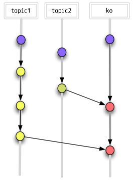
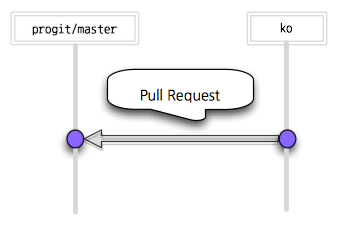
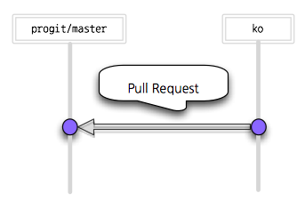
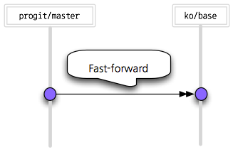

--- yaml
layout: 'article'
title: 'Git:번역 Workflow'
author: 'Changwoo Park'
date: '2012-2-2'
tags: ['Git', '번역', 'Workflow']
---

Git으로 번역한다는 것은 아마도 CCL을 따르는 영문 자료를 우리말로 번역하는 것을 의미할 것이다. Pro Git 번역도 그랬다. Pro Git을 번역하면서 정리한 Workflow를 소개한다. 다른 번역 프로젝트에 도움을 줄 수 있으면 좋겠다.

## 번역

Git을 사용하는 데 있어서 번역 프로젝트는 개발 프로젝트와 다르다. 훨씬 더 정적이다. 만들어야 하는 브랜치 수도 적고 버그를 발견해도 좀 더 느슨하게 대처해도 된다. 며칠 늦었다고 해서 수갑을 차는 것도 아니고 경찰이 출동하지도 않는다.

Git은 번역 작업을 관리하는데도 좋다. 특히 원문 자체가 계속 수정되는 진행 중인 자료들이기 때문에 번역도 완성된 상태라고 볼 수 없고 항상 진행 중이라고 봐야 한다. Git은 이 상태를 추적하고 관리하는데 최상의 도구다.

Pro Git을 번역할 때 Git을 어떻게 사용해야 할지 몰랐기 때문에 헤매고 시간을 낭비했었다. 번역할 때는 어떤 브랜치가 필요한지 그리고 어떻게 사용하는 것이 좋은지 그동안 고민한 Workflow를 공개한다.

## 브랜치

몇 번의 삽질을 거쳐서 지금과 같은 번역 Workflow를 만들었다.

여기서는 사용한 브랜치는 다음과 같다:

  * master - progit/master를 Tracking하는 브랜치
  * topic - 작업 브랜치들
  * ko - 번역이 완료되면 이 브랜치에 Merge하고 Pull Request를 보낸다.
  * ko-base - 원문, 어느 시점을 기준으로 번역했는지 기록하는 브랜치
  * private - 절대 Pull Request를 보내지 않을 브랜치들

### master

progit/master를 Tracking하는 브랜치이다. master 브랜치를 직접 수정하지 않는다.

이 브랜치를 progit/master를 Tracking하도록 한 이유는 별로 쓸모가 없어서다. Pull Request하는 브랜치를 ko 브랜치로 해야 했고 원문의 master 브랜치가 가리키는 커밋을 가리키는 로컬 브랜치가 하나 있는 게 편하기도 했다.

이 브랜치는 항상 progit/master를 따라가는 것이니까 항상 Fast-forward Merge된다.

### 토픽들

Pro Git을 번역할 때는 Chapter 별로 브랜치를 만들었다. 01, 02, ..., 09 브랜치를 만들고 번역했다. 이 브랜치를 그대로 Push해서 다른 사람에게 리뷰를 요청했다. 책에 Chapter가 없어도 섹션 별로 만들 수도 있다.

책 내용뿐만 아니라 보통 ebook을 빌드하는 구조를 가진 책들은 설정 파일과 빌드 스크립트도 수정해야 한다. 이것을 위한 토픽 브랜치도 만든다. 이때는 꼭 브랜치 이름이 ko-build로 시작하게 했다.

### ko

이 브랜치가 핵심 브랜치다. Git-flow에 비교하자면 develop 브랜치에 해당한다고 할 수 있다. 토픽 브랜치에서 작업을 완료하면 커밋과 커밋 메시지를 정리하고 ko 브랜치에 Merge했다. 

곧 Pull Request를 보낼 브랜치이기 때문에 토픽 브랜치를 Merge할 때 커밋을 잘 정리해서 Merge한다.

브랜치 이름을 `ko`라고 해야 하는 이유는 Merge 커밋에 브랜치 이름이 기록되기 때문이다. 보통 Git의 Merge 커밋은 다음과 같다:

    Merge branch 'ko' into master

Github에서 Pull Request를 Merge했을 때의 커밋 메시지는 거의 같지만 다르게 생겼다:

    Merge pull request #158 from dogfeet/ko

해당 Pull Request의 이슈 번호와 저장소 이름/브랜치 이름이 기록된다. 그래서 한국어를 나타낼 수 있도록 ko라는 이름으로 만든다.

Pull Request를 보내고 나서 원문 저장소에 Merge되면 다시 히스토리를 맞춰 주어야 한다. 원문 저장소는 한글뿐만 아니라 스페인어, 불어, 독어 등등의 커밋이 계속 업데이트된다. ko 브랜치를 삭제하고 다시 만들어도 되지만 reset 명령으로 ko 브랜치 포인터를 옮길 수 있다:

    $ git checkout master
    $ git merge progit/master #Fast-forward Merge
    $ git checkout ko
    $ git reset --hard master

원문 저장소의 리모트 이름이 progit라고 가정한다:

#### ko-build

어떤 커밋은 확실히 메인 저장소에 Push해야 하지만 어떤 커밋은 Dictator(원문 저장소 관리자)가 검토하고 Merge해 주길 바랄 것이다. 그런데 번역은 언어 문제로 Dictator가 검토할 수 없다. 빌드 스크립트 로직 문제를 제외하고는 원문 Dictator가 해줄 수 있는 게 없다.

빌드 스크립트나 관련 설정을 Pull Request로 보낼 때에도 `ko` 브랜치에 Merge해서 보냈다. 하지만, 빌드 스크립트 로직을 수정해야 한다면 Merge하는 것이 옳은지 Dictator가 검토해주길 바랄 테니까 본문과 별도로 보냈다. Pull Request는 브랜치 단위로 요청하는 것이니까 본문을 위한 브랜치 'ko'말고 다른 브랜치가 필요하다.

**Note:** 하지만 Dictator가 검토하는지 알 수 없다. 영어 폰트를 임의로 수정해서 Pull Request를 보냈는데 Dictator인 [schacon][]은 그대로 Merge했다.

Dictator가 검토해주길 바라는 내용은 ko-build 브랜치를 만들어 Pull Request를 보낸다. 스크립트는 한번 고치면 다시 고쳐야 할 일은 거의 없다.

[schacon]: https://github.com/schacon

### ko-base

ko-base 브랜치가 가리키는 시점이 번역한 원문 시점을 나타낸다. 원본이 수정되면 이 브랜치를 이용해서 살펴보고 추가 번역해서 ko 브랜치에 반영하고 ko-base 브랜치는 최신으로 옮겨 놓는다. 그래서 master 브랜치처럼 항상 Fast-forward Merge된다.

master가 있는데 ko-base가 필요할까? 이 부분은 논쟁이 될 수 있다. ko-base 없이 master를 이용해도 된다. 분명한 근거를 제시할 수는 없지만, 목적을 스스로 설명하는 이름으로 된 브랜치를 사용하는 것이 옳다고 판단했고 확실히 구분해 사용했다.

이 브랜치도 항상 progit/master를 따라가는 것이니까 항상 Fast-forward Merge된다.

ko-base를 브랜치가 아닌 Tag로 만들어도 된다. 하지만, Tag는 가리키는 커밋을 옮길 수 없다. 삭제하고 다시 만들어야 한다. 시점이 옮기는 것이니까 Fast-forward Merge가 적당하다고 생각한다.

### private

중앙 저장소에 Merge하지 않을 커밋을 담아둘 브랜치도 필요하다. 확신이 없거나 중앙 저장소에 Merge했을 때 구조적으로 문제가 생길 수도 있는 것을 이 브랜치에 넣는다. 즉, 절대 Pull Request를 보내지 않을 커밋은 private으로 시작하는 브랜치에 넣는다.

dogfeet/progit에서는 'private-ko-build-ebook', 'private-ko-build-ubuntu'라는 브랜치를 만들어 사용했다. 'private-ko-build-ubuntu'는 Jenkins가 설치된 ubuntu 환경에 맞춘 코드를 넣었고, 원문에는 없는 오타와 오역 신고를 부탁한다는 글은 'private-ko-build-ebook'에 넣어 두었다.

private으로 시작하는 브랜치 규칙을 만든 이유는 실제로 실수를 저질렀기 때문이다. @lethee가 빌드 스크립트와 설정을 수정했다. 그리고 그 수정한 것을 내가 다시 정리해서 Pull Request를 보냈는데, 커뮤니케이션이 미숙해서 @lethee의 의도대로 Pull Request하지 않았다. 그래서 영어 폰트를 수정한 커밋이 progit 저장소에 들어가 버렸다. 그래서 이런 규칙을 만들었다.

#### 요약

Pull Request를 보내는 브랜치:

  * **ko** - 번역 브랜치, 각 토픽 브랜치 별로 Pull Request를 보낼 수도 있지만, Dictator가 Merge하기 편리하도록 정리해서 보낸다.
  * **ko-build** - 빌드 스크립트용 브랜치. Dictator가 검토해주길 바라는 내용.

Tracking 브랜치:

  * **master** - progit/master를 Tracking하는 브랜치
  * **ko-base** - 어느 시점을 기준으로 번역했는지 기록해 두는 브랜치

Pull Request를 보내지 않을 브랜치:

  * '**private**'으로 시작하는 브랜치.

그 외:

  * 토픽 브랜치 – 브랜치 대부분은 실제 번역을 하는 토픽 브랜치다. 깔끔하게 작업하는 것은 ko 브랜치에 Merge할 때까지 미뤄도 된다.

## 커밋 메시지

번역을 시작하면서 기존의 커밋 메시지를 훑어 봤는데 대부분 사람은 일정 규칙을 지키고 있었다. 물론 규칙을 지키지 않는 커밋들도 계속 올라왔고 강제하는 것처럼 보이진 않았다.

커밋 메시지는 첫 줄은 다음과 같은 형식을 따른다.

    [ko] Chapter 1: 오타 수정

    본문...

## GitHub 저장소의 기본 브랜치.

Pull Request를 보낼 때 Request마다 어느 브랜치에 Merge해야 하는지 선택해서 보낼 수 있다. 하지만, 기본 값은 저장소의 기본 브랜치이다.

그러니 GitHub의 번역 저장소의 기본 브랜치를 `ko`로 해야 다른 사람이 번역본에 기여할 때 `ko` 브랜치로 Pull Request를 보내기 쉬워진다:

## 예제

수정된 원문을 번역에 적용하는 예제를 살펴보자. 여기서 설명하는 예제는 [Pro Git][progit]이 아니라 [JavaScript-Garden][]의 예이다. 이 글을 쓰는 동안에 마침 BonsaiDen이 원문을 수정해줬다. 그동안 변경된 원문을 찾아 번역도 수정하는 것을 설명한다.

### 브랜치 확인

원문 저장소의 리모트 이름은 owner고 번역 저장소의 리모트 이름은 origin이다.

#### 로컬 저장소

`git todo`를 실행해서 브랜치 상태를 확인한다. [git-todo][] 사용법은 따로 설명해 놓았다:

    $ git todo
          [@] ko - 09b4f9c - ...
    [-1] ko-base - e7c00d8 - ...
     [-1] master * e7c00d8 - ...

다시 설명하지만 `master`는 `owner/master`를 Tracking한다. 그리고 ko-base는 마지막으로 번역할 때 기준으로 삼은 시점을 기록해 둔 것이다. 그리고 ko는 새로 번역을 수정해 놓은 브랜치다.

`[-1]`은 `[@]` 표시가 있는 브랜치 보다 커밋이 하나 적다는 것을 말한다. ko 브랜치에 JavaScript-Garden 한글 버전을 퇴고해서 Pull Request를 보냈다. 그래서 master보다 커밋이 하나 더 많다. BonsaiDen은 이 Pull Request를 Merge했다. 이제 owner 저장소를 확인하자.

[git-todo]: /articles/2012/git-todo.html

#### owner 저장소

owner 저장소를 fetch한다:

    $git fetch owner
    remote: Counting objects: 164, done.
    remote: Compressing objects: 100% (44/44), done.
    remote: Total 101 (delta 65), reused 80 (delta 45)
    Receiving objects: 100% (101/101), 41.53 KiB | 42 KiB/s, done.
    Resolving deltas: 100% (65/65), completed with 32 local objects.
    From https://github.com/BonsaiDen/JavaScript-Garden
       962617e..67775b0  gh-pages   -> owner/gh-pages
       e7c00d8..01fe309  master     -> owner/master

그리고 나서 브랜치 상태를 확인한다:

    $ git todo -r
                        [@] ko - 09b4f9c - ...
                  [-1] ko-base - e7c00d8 - ...
                   [-1] master * e7c00d8 - ...
                     origin/ko - 09b4f9c - ...
           [-1] origin/ko-base - e7c00d8 - ...
            [-1] origin/master - e7c00d8 - ...
            [-388] origin/next - c204a58 - ...
    [+84][-143] owner/gh-pages - 67775b0 - ...
            [+14] owner/master - 01fe309 - ...
             [-388] owner/next - c204a58 - ...

`owner/master`에 새로운 커밋이 생겼다. master는 단순히 `owner/master`를 Tracking하는 브랜치니까 master에 Merge한다:

    $ git co master
    $ git merge owner/master

ko 브랜치가 Merge됐는지 확인한다. 히스토리를 보면 다음과 같은 커밋이 들어 있다:

    34c3271 Merge pull request #121 from pismute/ko
    09b4f9c [ko] proofreading

Merge됐으므로 ko 브랜치가 owner/master를 가리키게 한다:

    $ git co ko
    $ git reset --hard owner/master

그리고 나서 브랜치 상태를 확인해보자:

    $ git todo -r
                        [@] ko * 01fe309 - ...
                 [-15] ko-base - e7c00d8 - ...
                        master - 01fe309 - ...
               [-14] origin/ko - 09b4f9c - ...
          [-15] origin/ko-base - e7c00d8 - ...
           [-15] origin/master - e7c00d8 - ...
            [-402] origin/next - c204a58 - ...
    [+84][-157] owner/gh-pages - 67775b0 - ...
                  owner/master - 01fe309 - ...
             [-402] owner/next - c204a58 - ...

`owner/master`에 맞추어 브랜치를 정리했다. `owner/master`, `master`, `ko` 브랜치는 이제 같은 커밋을 가리킨다.

원문에서 무엇이 변경됐는지 살펴보고 번역을 수정해보자

### 무엇이 변경됐는지 찾아 번역한다.

먼저 변경된 커밋 중에서 어떤 파일들이 변경됐는지 확인해보자. ko-base 브랜치가 이미 번역한 번역본의 기준이므로 master와 ko-base 브랜치를 비교한다. 이때 브랜치 순서가 중요하다. `ko-base...master` 같이 `ko-base`를 먼저 사용한다. 순서를 반대로 쓰면 diff 명령에서 헷갈리기 쉽다.

    $ git log --pretty=oneline --abbrev-commit --left-right --name-only ko-base...master
    > 01fe309 Finally get around and start fixing some issues
    doc/en/core/undefined.md
    doc/en/function/constructors.md
    doc/en/function/scopes.md
    doc/en/object/hasownproperty.md
    > 98a1f31 Merge pull request #114 from krawaller/master
    > 65f0d9e Merge pull request #77 from xavierm02/master
    > 27b4b2f Merge pull request #117 from oozcitak/tr
    > 666edda Merge pull request #116 from szTheory/patch-1
    > 34c3271 Merge pull request #121 from pismute/ko
    > 09b4f9c [ko] proofreading
    doc/ko/array/constructor.md
    doc/ko/array/general.md
    doc/ko/core/delete.md
    doc/ko/core/eval.md
    doc/ko/core/semicolon.md
    doc/ko/core/undefined.md
    doc/ko/function/arguments.md
    doc/ko/function/closures.md
    doc/ko/function/constructors.md
    doc/ko/function/general.md
    doc/ko/function/scopes.md
    doc/ko/function/this.md
    doc/ko/intro/index.md
    doc/ko/object/forinloop.md
    doc/ko/object/general.md
    doc/ko/object/hasownproperty.md
    doc/ko/object/prototype.md
    doc/ko/other/timeouts.md
    doc/ko/types/casting.md
    doc/ko/types/equality.md
    doc/ko/types/typeof.md
    > 919b581 [tr] Fixed typo
    doc/tr/core/delete.md
    > 753fd78 Added delete to index
    doc/tr/index.json
    > c8258d1 [tr] Translated delete
    doc/tr/core/delete.md
    > cd06184 [tr] Fixed type
    doc/tr/function/scopes.md
    > be27b01 grammar
    doc/en/function/this.md
    > 103ca5d removed trailing whitespace in comment on line 55 which caused line to spill outside code container
    doc/fi/function/arguments.md
    > 0a894c1 Stored the biggest timeout ID to avoid infinite loop.
    doc/en/other/timeouts.md
    > 53decce Added another way to clear "all" timeouts and replaced the "is is" by "it is".
    doc/en/other/timeouts.md

그동안 수정된 커밋이 좀 있다. 영어로 된 것을 번역한 것이니 이 중에서 `doc/en` 파일이 수정된 것만 확인한다. `doc/en` 디렉토리에 있는 파일만 조회하자:

    $ git log --pretty=oneline --abbrev-commit --left-right --name-only ko-base...master doc/en
    > 01fe309 Finally get around and start fixing some issues
    doc/en/core/undefined.md
    doc/en/function/constructors.md
    doc/en/function/scopes.md
    doc/en/object/hasownproperty.md
    > 65f0d9e Merge pull request #77 from xavierm02/master
    > 666edda Merge pull request #116 from szTheory/patch-1
    > be27b01 grammar
    doc/en/function/this.md
    > 0a894c1 Stored the biggest timeout ID to avoid infinite loop.
    doc/en/other/timeouts.md
    > 53decce Added another way to clear "all" timeouts and replaced the "is is" by "it is".
    doc/en/other/timeouts.md

커밋 정보 없이 수정된 파일만 볼 수도 있다:

    $ git diff --name-only ko-base..master doc/en
    doc/en/core/undefined.md
    doc/en/function/constructors.md
    doc/en/function/scopes.md
    doc/en/function/this.md
    doc/en/object/hasownproperty.md
    doc/en/other/timeouts.md

파일 내용까지 보려면 `--name-only` 옵션을 빼면 된다. 그러면 diff 내역을 모두 보여준다. 한 번에 보면 너무 많으니 하나씩 diff를 확인해 볼 수 있다. `doc/en/core/undefined.md` 파일의 diff 내용을 살펴보자:

    $ git diff ko-base..master doc/en/core/undefined.md
    diff --git a/doc/en/core/undefined.md b/doc/en/core/undefined.md
    index d27761f..c819920 100644
    --- a/doc/en/core/undefined.md
    +++ b/doc/en/core/undefined.md
    @@ -19,11 +19,13 @@ overwritten.
     Some examples for when the value `undefined` is returned:

      - Accessing the (unmodified) global variable `undefined`.
    + - Accessing a declared *but not* yet initialized variable
      - Implicit returns of functions due to missing `return` statements.
      - `return` statements which do not explicitly return anything.
      - Lookups of non-existent properties.
      - Function parameters which do not had any explicit value passed.
      - Anything that has been set to the value of `undefined`.
    + - Any expression in the form of `void(expression)`

     ### Handling Changes to the Value of `undefined`

파일을 하나씩 diff해보면서 번역을 수정한다. 수정하고 커밋한 후에 브랜치를 살펴보자.

    $ git todo -r
                        [@] ko * c712143 - ...
                 [-16] ko-base - e7c00d8 - ...
                   [-1] master - 01fe309 - ...
               [-15] origin/ko - 09b4f9c - ...
          [-16] origin/ko-base - e7c00d8 - ...
           [-16] origin/master - e7c00d8 - ...
            [-403] origin/next - c204a58 - ...
    [+84][-158] owner/gh-pages - 67775b0 - ...
             [-1] owner/master - 01fe309 - ...
             [-403] owner/next - c204a58 - ...

`ko` 브랜치에 번역을 수정하고 커밋했기 때문에 `owner/master`보다 커밋이 한 개 많다.

### ko-base 옮겨 놓고 Pull Request 보내기

다음에 원문이 수정됐을 때 다시 참고 할 수 있도록 ko-base가 owner/master를 가리키도록 한다.

    $ git checkout ko-base
    $ git reset --hard owner/master

그리고 저장소를 origin에 Push한다. Push하고 나면 브랜치 상태는 다음과 같아진다:

    $ git todo -r
                        [@] ko - c712143 - ...
                  [-1] ko-base * 01fe309 - ...
                   [-1] master - 01fe309 - ...
                     origin/ko - c712143 - ...
           [-1] origin/ko-base - 01fe309 - ...
            [-1] origin/master - 01fe309 - ...
            [-403] origin/next - c204a58 - ...
    [+84][-158] owner/gh-pages - 67775b0 - ...
             [-1] owner/master - 01fe309 - ...
             [-403] owner/next - c204a58 - ...

이제 원문이 수정된 만큼 번역도 수정했으니 Pull Request를 보내면 된다. 그리고 다음에 추가로 수정된 부분이 있으면 이어서 다시 번역할 수 있다.

[JavaScript-Garden]: http://bonsaiden.github.com/JavaScript-Garden/

## 결론

번역 작업에도 Git은 매우 훌륭하다. 번역은 개발과 달라서 다른 Workflow가 필요하다. [git-flow][]처럼 번역 시 참고할 만한 자료가 있으면 좋을 것 같아서 정리했다.

[git-flow]: /articles/2011/a-successful-git-branching-model.html
[progit]: /articles/2012/progit.html
